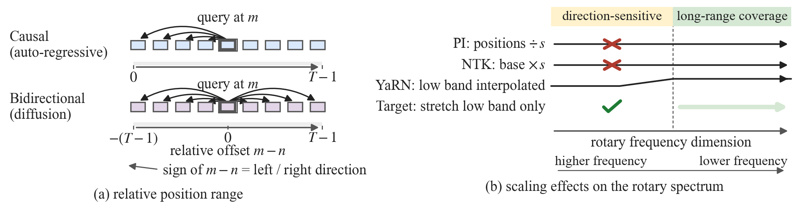
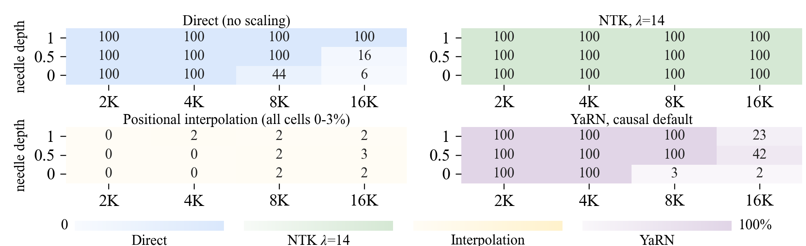
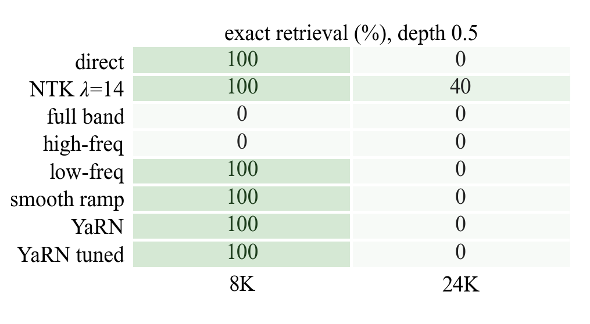
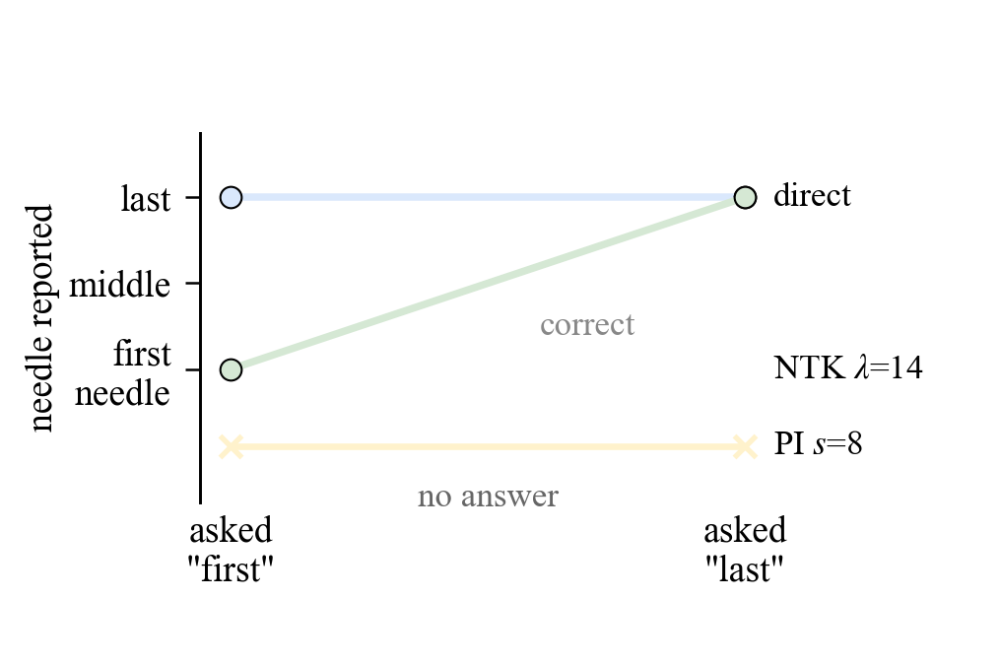

# Positional Interpolation Has No Usable Operating Point under Bidirectional Attention

Code and results for the paper *"Positional Interpolation Has No Usable Operating
Point under Bidirectional Attention: An In-Window Failure"* (ICASSP 2027).

We evaluate five training-free RoPE scaling methods on the diffusion language model
LLaDA-8B, and characterise where each of them stops working.

**Headline result.** Positional interpolation (PI) has a sharp threshold that lies
*inside* the 4K training window: doubling the compression factor from `s=2` to `s=4`
costs all in-window accuracy, and the factor that survives in-window cannot extend
the local-perception window. Uniform NTK-style base scaling at the factor the
scaling law prescribes is safe and effective up to about six times the training
length, and fails beyond it.

---

## Figures

**Fig. 1.** Why the two attention patterns make different demands on the position
code. Under causal attention a token only ever sees earlier tokens, so the code
encodes distance alone. Under the bidirectional attention of a diffusion LM it must
also resolve the sign of the relative offset, which is what the high-frequency
dimensions carry.



**Fig. 2.** Needle retrieval accuracy (%) against context length at three needle
depths. Direct extrapolation keeps only the final quarter of the document at 16K;
the prescribed NTK factor is perfect in every cell; interpolation fails above its
compression threshold; the causal-default YaRN ramp fails erratically.



**Fig. 3.** Frequency-band ablations at depth 0.5, as exact-retrieval rate (%).
Stretching the high-frequency dimensions, or the whole band, destroys in-window
retrieval at 8K, while sparse or ramped low-frequency stretching preserves it. No
band choice reaches 24K, where only the prescribed uniform factor succeeds.



**Fig. 4.** Ordering probe at 8K. Each method is asked which of three needles comes
first and, separately, which comes last; the axis gives the document-order rank of
the needle it actually emitted. A method with real ordering ability follows the
dashed diagonal. Direct extrapolation is flat, returning the last needle whichever
endpoint is requested, so its perfect score on the "last" question is recency rather
than order. Interpolation never emits a needle.



Figure PDFs are in `figures/`; the PNGs above are for display. All of them are
regenerated by `make_figures.py` and `make_fig1.py` from the JSONs in `results/`.

---

## Layout

```
exp_lib.py             shared library: model loading, RoPE overrides, NIAH prompts,
                       scoring, result IO
exp_run_matrix.py      method x length x depth grid  (main matrix, 24K/32K ceiling)
exp_run_freqband.py    frequency-band ablations, YaRN ramps, per-dimension rules,
                       chunked position reset
exp_run_order.py       multi-needle ordering probe
exp_analyze.py         offline error classification of stored raw answers
make_figures.py        figures 2-4 from the result JSONs
make_fig1.py           figure 1 (mechanism diagram)
fig_data.py            transcribed fallback values for make_figures.py
results/               one JSON per experiment (raw decoded answers included)
figures/               the four PDFs included in the paper
figures/png/           the same four figures as PNGs (for this README)
```

## Requirements

* Python 3.10+, PyTorch with CUDA
* `transformers==4.46.3` (the patched LLaDA modeling code expects this version)
* `numpy`, `matplotlib`
* A LLaDA-8B checkpoint (Instruct and, for the checkpoint control, Base)
* The LongLLaDA release, for its `llada_generate.generate` decoding routine

Weights are not redistributed here. Point the code at your local copy:

```bash
export LLADA_WEIGHTS=/path/to/LLaDA-8B
```

`exp_lib.py` keeps Hugging Face offline and fails fast if the directory is missing,
so a typo does not turn into a long network retry.

Decoding follows LongLLaDA: block length 32, 32 denoising steps, `gen_length` 32,
temperature 0, low-confidence remasking, no classifier-free guidance, fp16 with
FlashAttention-2.

## Decoding and scoring conventions

A cell is scored by exact keyword match (100), otherwise `0.2 x` the Levenshtein
similarity of the decoded answer against the reference sentence. Because the second
term is not zero, **a score near 2 is a formatting artifact of a wrong or copied
answer, not partial retrieval**. This is why the paper reports exact counts rather
than means, and why we also classify every stored answer into
`exact / near / wrong_number / no_number / empty` with `exp_analyze.py`.

Every reported cell has a deterministic seed derived from its context length, needle
depth and sample index, so all methods see identical inputs within a cell.

## Reproducing the paper

The commands below are the ones that produced the JSON files in `results/`. Adjust
`--weights` to your checkpoint path.

### Main matrix (Fig. 2, Table I, the 16K and 24K rows)

```bash
python exp_run_matrix.py --weights "$LLADA_WEIGHTS" --flash \
    --methods direct,ntk_x14,pi_x8,yarn_32_1_8,dyn_16 \
    --lengths 2048,4096,8192,16384 \
    --depths 0,0.25,0.5,0.75,1.0 --samples 5 \
    --out results/expM_matrix.json
```

### The PI factor sweep (Table II)

```bash
python exp_run_matrix.py --weights "$LLADA_WEIGHTS" --flash \
    --methods direct,pi_x2,pi_x4,pi_x8,pi_x16 \
    --lengths 2048,4096,8192,16384 --depths 0.5 --samples 5 \
    --out results/expPI_sweep.json
```

### Frequency-band ablations (Fig. 3)

```bash
python exp_run_freqband.py --weights "$LLADA_WEIGHTS" --flash \
    --lengths 8192,24576 --depths 0.5 --samples 5 --scale 14 \
    --band-modes full,low_only,high_only,smooth \
    --yarn-cfgs 32:1:8,8:1:8,4:1:16 \
    --out results/expB2_freqband.json
```

### Ordering probe (Fig. 4)

```bash
python exp_run_order.py --weights "$LLADA_WEIGHTS" --flash \
    --lengths 8192 --depths 0.5 --samples 5 \
    --variants direct,ntk_x14,ntk_x55,band_low_only,pi_x8 \
    --out results/expOrder_8k.json
```

### Error classification

```bash
python exp_analyze.py results/expM_matrix.json \
    --group method --out results/analysis_matrix.json
```

### Checkpoint control (LLaDA-8B-Base)

```bash
python exp_run_matrix.py --weights /path/to/LLaDA-8B-Base --flash \
    --methods direct,ntk_x14,pi_x8 \
    --lengths 2048,4096 --depths 0.5 --samples 5 \
    --out results/expM_base_inwindow.json
```

### Figures

```bash
python make_figures.py --results results --outdir figures
python make_fig1.py
```

`make_figures.py --verify results` diffs the transcribed fallback table in
`fig_data.py` against the run JSONs. All values agree on the shipped results.

## Results files

| File | Contents |
|---|---|
| `expM_matrix.json` | 5 methods x 4 lengths x 5 depths x 5 samples (500 cells) |
| `expPI_sweep.json` | PI factors 2, 4, 8, 16 vs direct, depth 0.5 |
| `expM_ceiling.json`, `expM_ceiling32k*.json` | 24K and 32K ceiling probes |
| `expB2_freqband.json`, `expB2_rest.json` | band ablations and YaRN ramps |
| `expOrder_8k.json`, `expOrder_24k_probe.json` | ordering probe |
| `expM_base_inwindow.json` | LLaDA-8B-Base checkpoint control |
| `analysis_*.json` | the same runs with a failure category per answer |

Two files hold PI results and they cover **different experiments**, which matters
when comparing their numbers:

* `analysis_matrix.json` — PI at `s=8` over all five depths (100 cells). This is the
  source of the PI row in the answer-composition table.
* `analysis_pi_sweep.json` — PI at `s in {2,4,8,16}` at depth 0.5 only (80 cells).
  This is the source of the "41 of 80" figure for `s>=2`.

Every result JSON stores the raw decoded string for each cell, including the failed
ones, so the failure modes can be inspected directly rather than inferred from
aggregate scores.

## What else we tried

The paper also reports four further families of scaling rule that do not work, each
for a different reason. They are implemented in `exp_lib.py` and reachable through
`exp_run_freqband.py`, but the negative runs are not part of the shipped results:

* `--bm-*` per-dimension stretch sized to the target wavelength
* `--ramp-*` the same idea capped at a factor already measured safe
* `--chunks` chunked position reset, which keeps every index inside the trained
  window but breaks adjacency at each chunk boundary

To rerun any of them:

```bash
python exp_run_freqband.py --weights "$LLADA_WEIGHTS" --flash \
    --lengths 8192,24576 --depths 0.5 --samples 5 \
    --band-modes '' --yarn-cfgs '' \
    --bm-keep-high 0,8,16,32 --bm-smax 14,31,55 \
    --out results/expB3_bm.json
```

Because these rules reason about absolute wavelengths, `exp_lib.py` refuses to
install them on a model whose `rope_theta` was already pre-scaled by the NTK path,
which would otherwise silently double-count the factor.

## Computation

All experiments are inference-only; no training or fine-tuning. Total cost was under
twenty GPU-hours on a single 48 GB GPU.

## Citation

```bibtex
@inproceedings{cheng2027positional,
  title     = {Positional Interpolation Has No Usable Operating Point under
               Bidirectional Attention: An In-Window Failure},
  author    = {Cheng, Yuxiang and Tang, Quanwei and Kong, Fang and Zhang, Dong},
  booktitle = {IEEE International Conference on Acoustics, Speech and Signal
               Processing (ICASSP)},
  year      = {2027}
}
```

## Licence

Code is released under the MIT Licence (see `LICENSE`).

The model weights (LLaDA-8B, LLaDA-8B-Base) and the LongLLaDA release are not
included in this repository and remain under their own licences.
